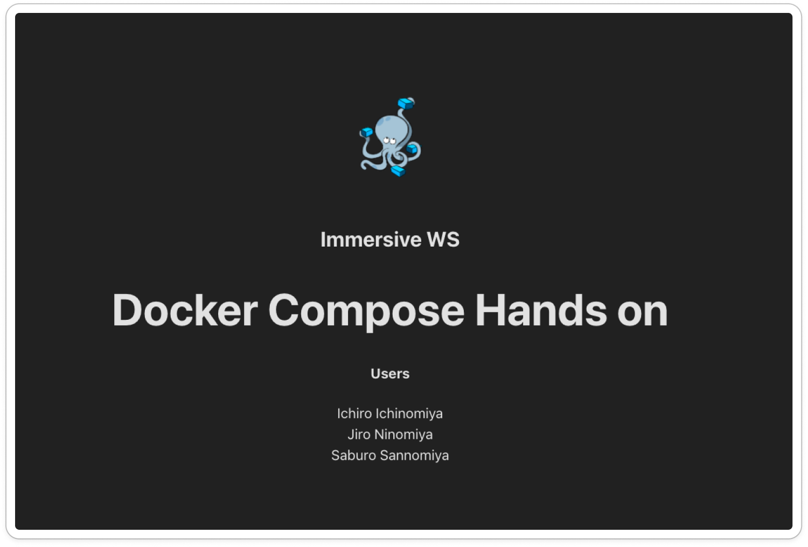

# Docker Compose Hands on (You do Advanced)


Immersive WS Docker講義 Day3 Composeのハンズオン用Repoです

web,api,dbのフルスタックアプリケーションの開発環境をDockerを駆使して構築するアドバンスド問題です

___

## プロジェクトの構成
- `/api` Spring Boot × kotlin のサーバーアプリケーション
- `/web` React × vite のwebアプリケーション

## この問題のゴール
`api`コンテナ, `db`コンテナに加えて、`web`コンテナを作成します。

`web - api - db`一気通貫のアプリケーションの開発環境をDockerを駆使して作り上げましょう。

`Dockerfile`, `docker-compose.yml`が正しく実装できたら

`/you-do-advanced` 直下で`make start` コマンドを実行し http://localhost:5173 にアクセス。

下の画像のように、アプリケーションのユーザーが表示されたら、見事ハンズオンクリアです！

※apiとの通信が成功していない場合、「Nobody...」が表示されてしまします。



___

## 前提条件

- `api`や`db`周りの仕様は`you-do-2`と同じです
- `web`の`App.tsx`にフロントエンドの実装があります。`localhost:8080/api/users`のエンドポイントを叩いて、結果を表示するロジックが含まれます。
- `web/src/vite.config.ts`にてproxyの設定をしています。`'/api': 'http://api:8080'`apiコンテナがComposeによって名前解決されているため、ホストにサービス名を指定できます。
※ proxyに`http://localhost:8080`を指定してしまうと、ホストのlocalhostをリッスンしてしまい、コンテナにアクセスできないため`ERR_EMPTY_RESPONSE`エラーとなります。


## ルール・やること

- `you-do-advanced/web/Dockerfile` を下記要件を満たすように実装します
- `you-do-advanced/docker-compose.yml` を下記要件を満たすように実装します
- webのソースの変更にホットリロードを効かせるために、volumeを設定する必要があります。
- コンテナの起動は、`Makefile` にまとまっています。ソースコードを見て何が実行されるか確認してください。
- ディレクトリ構造を変えてはいけません
- `Dockerfile`, `docker-compose.yml` 以外のファイルは変更しないでください。変更しなくてもDockerの実装がうまくいけば正しく動作するはずです。

___

### Dockerfileの要件

- imageは`node:18-alpine`を使用してください
- imageの`/app`ディレクトリに移動します
- パッケージのインストールに必要なファイルを、ホストPCからimageの`/app`にコピーします
- パッケージのインストールを実行するコマンドを設定します（`npm install`）
- Reactアプリの起動に必要なファイルを、imageの`/app`にコピーします
- コンテナ起動時に、Reactアプリを起動するコマンドを設定します（`npm run dev`）

___

### docker-compose.ymlの要件

- `web`という名前のサービスを定義します
- 適切なビルドコンテキストを指定します
- `container_name` は `compose-hands-on-you-do-advanced-web` に設定します
- ホストPCとwebコンテナのポートをマッピングします
- ネットワークは、apiコンテナ、dbコンテナと通信できるように設定してください
- webのソースの変更にホットリロード効かせるために、volumeを設定します。 この設定がないと、ホストPCのソースの変更がリアルタイムにwebコンテナに伝わらず、imageのビルドからやり直す手間が発生してしまい、開発効率が落ちてしまします。

##### volumesの指定の仕方
```yml
  web:
    volumes:
      - #ここに適切なvolumeを設定する
      - /app/node_modules 
          # ↑これはnode_modulesに空のvolumeを設定して、ホストとコンテナ間の齟齬を防止していいます。このまま書いてください。
```